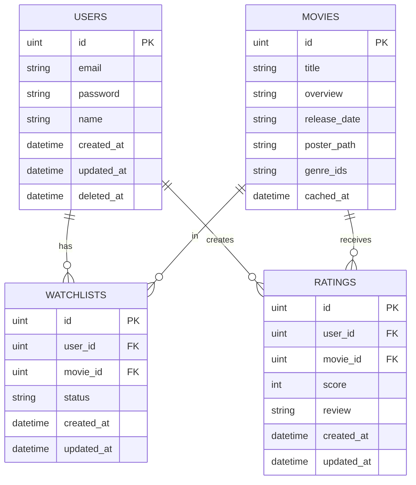

# Database ER Diagram

The Relational Schema for the Movie Watchlist Platform.

```mermaid
erDiagram
    USERS {
        uint id PK
        string email
        string password
        string name
        datetime created_at
        datetime updated_at
        datetime deleted_at
    }

    MOVIES {
        uint id PK
        string title
        string overview
        string release_date
        string poster_path
        string genre_ids
        datetime cached_at
    }

    WATCHLISTS {
        uint id PK
        uint user_id FK
        uint movie_id FK
        string status
        datetime created_at
        datetime updated_at
    }

    RATINGS {
        uint id PK
        uint user_id FK
        uint movie_id FK
        int score
        string review
        datetime created_at
        datetime updated_at
    }

    USERS ||--o{ WATCHLISTS : "has"
    USERS ||--o{ RATINGS : "creates"
    MOVIES ||--o{ WATCHLISTS : "in"
    MOVIES ||--o{ RATINGS : "receives"
```
